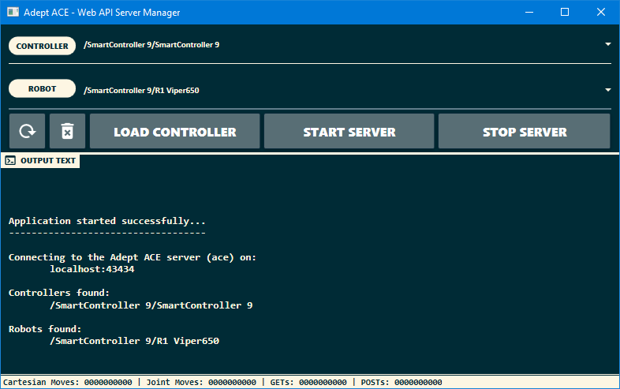

# Adept ACE Web API

This is a C# RESTful API for the Adept ACE environment. This API was developed specifically to control a ViperS650 robot, but could be easily extended to control other robots. The goal of this project was to create a web API that would provide easy access to command and move the robot arm via standard HTTP requests. The initial purpose was to enable programming via a LabView program, but extends to anything that can issue standard HTTP GET and POST requests (e.g., JavaScript, Python, etc.).

  - Install [Adept ACE 3.8.100](https://robotics.omron.com/browse-documents/?dir_id=8)
  - Start Adept Ace in as a server ([video guide](https://youtu.be/j9YGoNODSwQ?t=124))
    - Use `server=ace@43434` as show in the video.
  - Connect to the robot within a client only instance of Adept Ace by following the same steps for starting it as a server except that the string that is appeneded to the end is `client` not `server=ace@43434`.
    - If you are trying to test it out without a robot you can emulate one by checking `Open in Emulation Mode` and creating a workspace (which lets you select a robot to emulate) or load the one provided in this repo (`ACE_Workspace.awp`) which emulates a Viper 650.
  - Download the latest [release](https://github.com/damianj/Adept-ACE-Web-API/releases) or build the project in Visual Studio, and run the application
  - The application gui will pop-up and once you click `START` it will start listening on `localhost:9001`
  - See the usage documentation for available API endpoints and how to use them
  - Aside from being well-commented the code has HTML documentation available (more technical than the usage documentation), it is accessible by navigating to the `Help` folder of this repo and opening `index.html` in your browser of choice.

### GUI



### Testing

You can quickly test out API endpoints via the PowerShell by starting up Adept ACE, connecting to the robot, and starting the application and clicking `START`. After these steps you can use the PowerShell command below as a template to test out your API endpoints.

 - The command below calls a `CartesianMove` on the robot, other endpoints may take different JSON payloads or none at all. Edit the `X`, `Y`, `Z`, `Yaw`, `Pitch`, and `Roll` with the desired values for the move to be executed.
```powershell
PS > Invoke-WebRequest -UseBasicParsing http://localhost:9001/api/move/cartesian -ContentType "application/json" -Method POST -Body "{ 'Accel': 100, 'Decel': 100, 'Speed': 10, 'StraightMotion': true, 'MotionEnd': 'Blend', 'SCurveProfile': 0, 'X': 0, 'Y': 0, 'Z': 0, 'Yaw': 0, 'Pitch': 0, 'Roll': 0}"
```
 - The command below calls a `JointMove` on the robot, other endpoints may take different JSON payloads or none at all. Edit the `JointPosition` array in the JSON payload with the desired joint positions of the robot after the move.
```powershell
PS > Invoke-WebRequest -UseBasicParsing http://localhost:9001/api/move/joints -ContentType "application/json" -Method POST -Body "{ 'Accel': 100, 'Decel': 100, 'Speed': 10, 'StraightMotion': true, 'MotionEnd': 'Blend', 'SCurveProfile': 0, 'JointPosition': [0.0, 0.0, 0.0, 0.0, 0.0, 0.0]}"
```

### Resources

* [Nancy] - Light-weight web framework for C#
* [Newtonsoft] - Popular high-performance JSON framework for .NET
* [Volkanpaksoy] - Tutorial to get started developing with Nancy
* [Material Design in XAML] - Library to create responsive and clean GUI's 

### Continuing Development
You will need to install some packages via the Package Manager Console in Visual Studio

```powershell
PM> Install-Package Newtonsoft.Json

PM> Install-Package Nancy

PM> Install-Package Nancy.Hosting.Self

PM> Install-Package MaterialDesignThemes
```

Alternatively, you can enable the Package Restore function of NuGet within Visual Studio, and clean and build the project which should install the necessary packages automatically.

---
[](https://opensource.org/licenses/MIT)
###### [Wikimedia] - MIT licenese image

[//]: # (Reference Links - http://stackoverflow.com/questions/4823468/store-comments-in-markdown-syntax)

   [Adept ACE Custom API]: <https://damianj.github.io/MARSLab_ACEAPI/>
   [Material Design in XAML]: <http://materialdesigninxaml.net/>
   [Volkanpaksoy]: <http://volkanpaksoy.com/archive/2015/11/11/building-a-simple-http-server-with-nancy/>
   [Nancy]: <http://nancyfx.org/>
   [Newtonsoft]: <http://www.newtonsoft.com/json>
   [Wikimedia]: <https://upload.wikimedia.org/>
